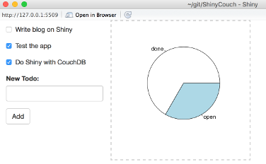

# ShinyCouch

Using [CouchDB](http://couchdb.apache.org/) from [Shiny](http://shiny.rstudio.com/): 
- pull JSON from CouchDB
- dashboards, incl. real CSS (so it can *really* be styled)
- incl. updates (add/check; though this is rather clumsy)

